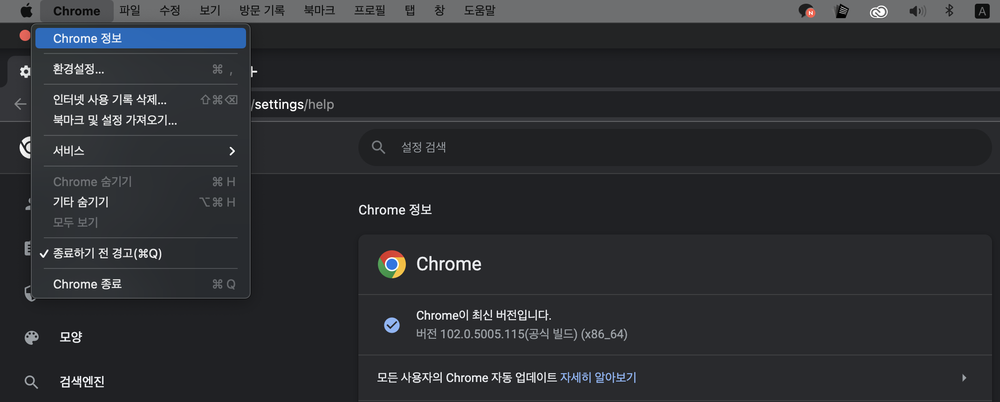

# 수강평가 매크로
수강평가 매크로 프로그램은 실행 시 자동으로 모든 수강 평가가 수행되도록 하는 자동화 프로그램입니다.

코드 상 오류 발견 시, jiniljeil1@gmail.com 으로 메일 주시면 감사드리겠습니다. 

### 1. Git clone 
```bash 
git clone https://github.com/Global-Handong-Oriented-Security-Team/Automated-Lecture-Assessment.git
``` 

### 2. Install Chromedriver 


크롬에 들어가셔서 Chrome 정보를 클릭하시면, 현재 자신이 사용하고 있는 버전을 확인할 수 있습니다. 자신의 크롬 버전을 확인한 후, <strong>자신의 버전에 맞는 chromedriver</strong>를 설치해줍니다.

현재 예제 버전의 경우, ChromeDriver 102.0.5005로 되어있기에 아래 링크에서 다운로드 받았습니다. 

Link: https://chromedriver.chromium.org/home

### 3. Execute auto lecture assessment program

테스트는 Python version 3.9로 진행하였습니다. 

```bash
python3.9 main.py
Enter a chromedriver path: "[/Users/jinil/Desktop/LectureAssessment/chromedriver]"
Enter a hisnet id: "[hisnetid]"
Enter a hisnet password: "[hisnetpw]"
```

#### 권한이 없어 프로그램 실행이 안될 경우

시스템 환경 설정 >> 보안 및 개인 정 보호 >> 자물쇠 클릭 >> 자물쇠 해체 후, 체크를 통해 터미널 제어 권한주기 >> 자물쇠 잠금

 

#### [Mac] “개발자를 확인할 수 없기 때문에 열 수 없습니다” 오류를 수정하는 방법

<a href="https://stepsboard.com/ko/mac%EC%97%90%EC%84%9C-%EA%B0%9C%EB%B0%9C%EC%9E%90%EB%A5%BC-%ED%99%95%EC%9D%B8%ED%95%A0-%EC%88%98-%EC%97%86%EA%B8%B0-%EB%95%8C%EB%AC%B8%EC%97%90-%EC%97%B4-%EC%88%98-%EC%97%86%EC%8A%B5%EB%8B%88">오류 발생 시 클릭</img>
